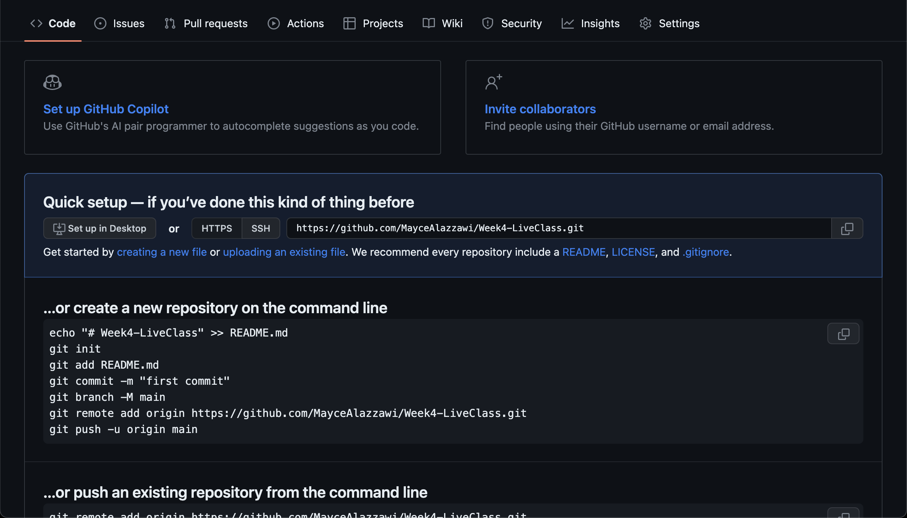
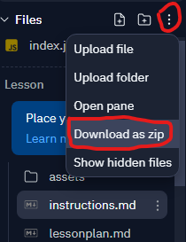
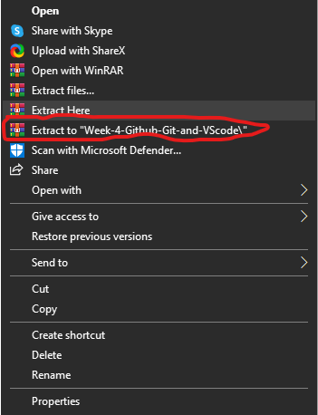
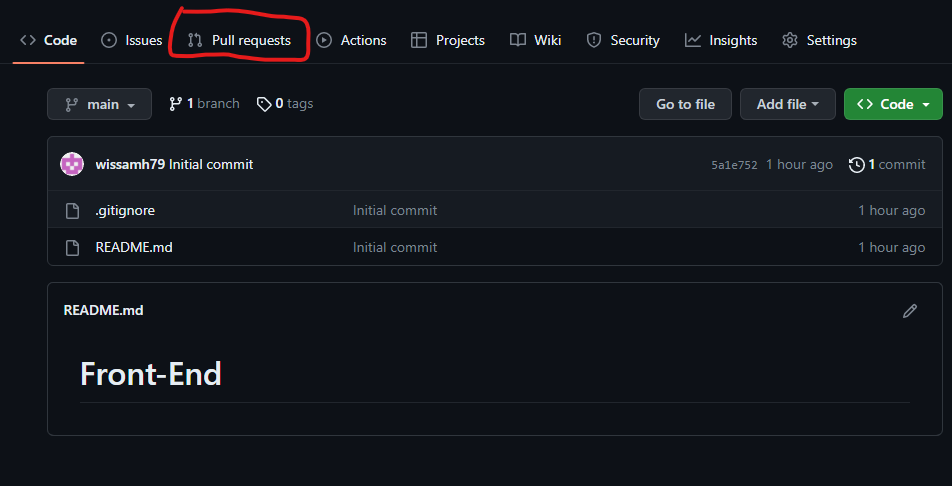
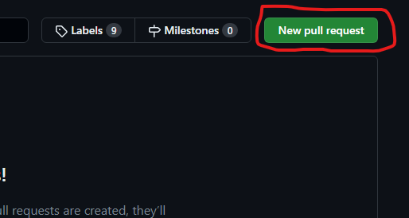
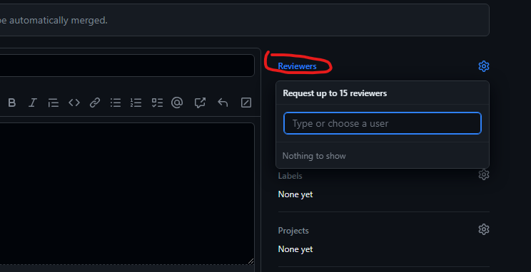
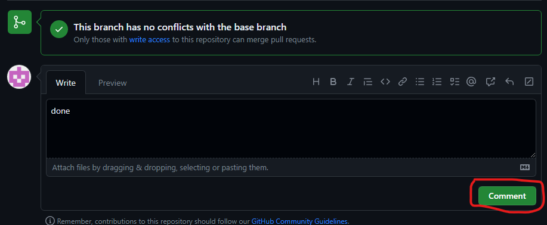

# Class Extension Lab

 

In this exercise, you will practice creating and manipulating Github repositories.
<br> <br>
## Goal

To learn how to use git and github to control your project and work with your team.


## Tips
Before we start make sure you had installed VS Code and git in your pc 


## Instructions  

  These instructions will guide you through the process of:
   - Setting up a GitHub repository.
   - Making an initial commit.
   - Creating a new branch.
   - Downloading and adding files to your local repository.
   - Committing your changes.
   - Pushing the branch to GitHub.
   - Creating a pull request.
   - Sending the pull request to a peer for review and reviewing your peer's pull request.


  ## Steps
  1. Create an empty repository on GitHub:
     - Go to the GitHub website ([github.com](https://github.com/)) and log in to your account.
     - Click on the "+" icon in the top-right corner of the page and select "New repository" from the dropdown menu.
     
     - Enter a name for your repository and choose the public option for this repo.
     - Click on the "Create repository" button to create the empty repository.
      Your repositery should look similar to this:
      
  <br><br>

  2. Make your first commit:
     - Clone the empty repository to your local machine using a Git client of your choice (e.g., Git command line, GitHub Desktop, or any other Git GUI tool).
     These rescources should help you see how to clone a repositery from github: <br>
      [How to Clone a Project From GitHub using VSCode?](https://www.geeksforgeeks.org/how-to-clone-a-project-from-github-using-vscode/) <br>
     [Clone and use a GitHub repository in Visual Studio Code](https://learn.microsoft.com/en-us/azure/developer/javascript/how-to/with-visual-studio-code/clone-github-repository?tabs=create-repo-command-palette%2Cinitialize-repo-activity-bar%2Ccreate-branch-command-palette%2Ccommit-changes-command-palette%2Cpush-command-palette)
     - Once the repository is cloned, navigate to the local repository's directory using the command line or file explorer.
     - Create a new file called "index.html" within the repository's directory.<br>
     Note: Use Google if you don't know where to find your local repository's directory.
     - Open the "index.html" file with a text editor and add the following basic HTML structure:
     ```
     <html>
     
     </html>
     ```
     - Save the changes to the "index.html" file.
     - In the command line or Git client, execute the following commands to commit the changes:
       ```
       git add index.html
       git commit -m "Initial commit"
       ```
       
  <br><br>

3. Make a new branch in your local GitHub repo.
-  Open VS code in your pc and then click on `file` and then click on `Open Folder` and open your project  folder.
-  open the TERMINAL by clicking on `Terminal` and then click open `New Terminal`.
  
   
- To make new branch enter `git branch <nameOfYourBranch>` in your Terminal.


<br><br>
4. Download the files of your portfolio assignment
- 
- Extract your folder by right click on the file that you downloaded and then 
<br><br>
5. Put the files in your local repo
- copy your portfolio assignment files from the folder that you extracted  and paste them in your project folder
Note: an error message wil pop up, beacuse now we will have two index.html files. To solve this problem you can replace the the old one with the new one.
<br><br>
6. Commit your changes
  - Commit by entering  this code 
  
     ```git
    git add .
    git commit -m <message>
     ```
     Note: Replace the <message> with a comment message that describes what are you adding to github. 
     ex: git commit -m "Adding portfolio files"
     
<br><br>
7. Push the branch
- Push by entering  this code
 ```git
  git push -u origin branch_name
 ```
<br><br>
8. Go to [GitHub](https://github.com/) and make a pull request (PR) using the new branch 

- go to pull request section :
- 
- click on New pull request

- click on the branch name and then click on` create pull requests`


<br><br>
9. Send your PR to your peer for review.

- click on `Reviewers` and pick your peer by entering her/his user name


- Leave comment if  you want.
- then click on create pull requests`


<br><br>
11. Review your peer’s PR and approve or request changes accordingly
-check the pull request section and review the PR and see the change that your peer made ,you must leave a comment  and then approve them by clicking on `comment`


<br><br>
### Nice work!  You have just finished this week assignment .

  